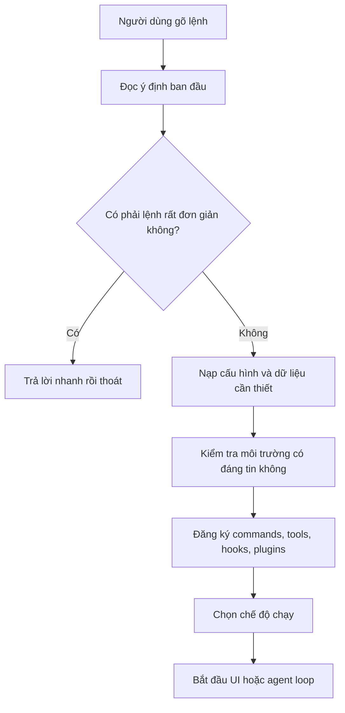
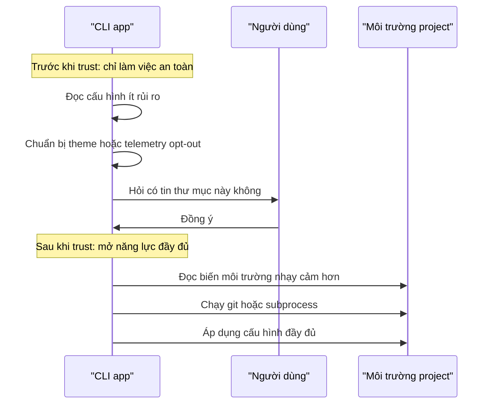
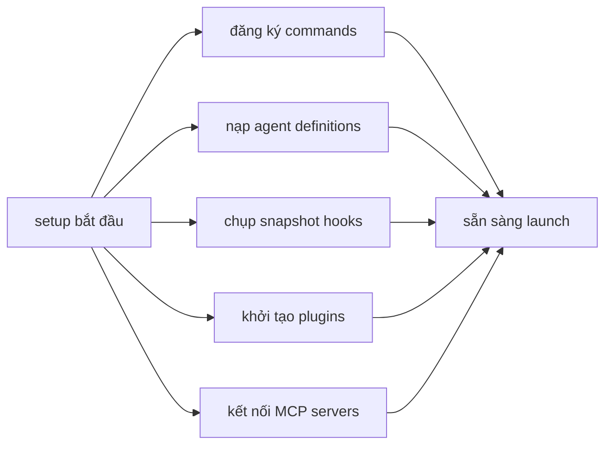
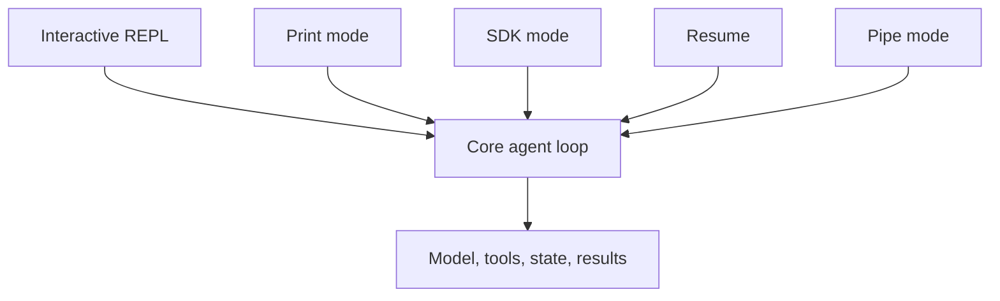
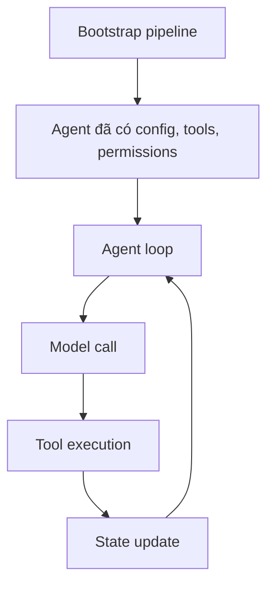

# Chapter 2 Cho Người Mới Hoàn Toàn: Bootstrap Pipeline

Tài liệu này chuyển hóa Chapter 2, "Starting Fast -- The Bootstrap Pipeline", sang cách đọc dành cho người chưa biết gì về AI agent architecture.

Mục tiêu không phải là nhớ từng file hay từng con số. Mục tiêu là hiểu câu hỏi nền tảng này:

> Trước khi một AI agent có thể trả lời, dùng tool, đọc file, hoặc sửa code, chương trình phải tự khởi động như thế nào?

Chapter 2 nói về đoạn khởi động đó. Đây chưa phải là phần "agent suy nghĩ". Đây là phần "chuẩn bị sân khấu" để agent có thể chạy đúng, nhanh, và an toàn.

## Bức Tranh Lớn

Khi bạn gõ một lệnh trong terminal, ví dụ:

```text
claude
```

hoặc:

```text
claude --version
```

hệ điều hành mở một process mới. Process đó không lập tức gọi AI model. Nó phải đi qua một pipeline khởi động:



Ý chính: một CLI agent tốt không khởi động bằng cách "load tất cả mọi thứ". Nó khởi động bằng cách liên tục hỏi:

> Việc này có thật sự cần cho yêu cầu hiện tại không?

Nếu không cần, nó bỏ qua.

## Glossary: Thuật Ngữ Cần Biết Trước

**AI agent** là một chương trình dùng AI model để quyết định bước tiếp theo. Một agent thường có state, có thể gọi tools, đọc kết quả, cập nhật state, rồi tiếp tục vòng lặp.

**Agent loop** là vòng lặp chính của agent. Mẫu rất đơn giản:

```text
nhận mục tiêu -> gọi model -> model chọn hành động -> chạy tool nếu cần -> nhận kết quả -> cập nhật trạng thái -> lặp lại
```

**CLI** là command-line interface, tức là chương trình chạy trong terminal. Khi bạn gõ lệnh thay vì bấm giao diện web, bạn đang dùng CLI.

**Bootstrap** là quá trình tự khởi động của chương trình. Nó xảy ra trước khi chương trình thật sự sẵn sàng phục vụ người dùng.

**Pipeline** là một chuỗi bước có thứ tự. Kết quả của bước trước trở thành đầu vào cho bước sau.

**Process** là một chương trình đang chạy trong hệ điều hành.

**Subprocess** là một process con do process chính tạo ra để làm một việc riêng, ví dụ đọc keychain hoặc kiểm tra chính sách công ty.

**argv** là danh sách tham số người dùng gõ sau tên lệnh. Ví dụ với `claude --version`, phần `--version` nằm trong argv.

**Import** là việc nạp một module code vào chương trình. Trong JavaScript/TypeScript, import một file có thể tốn thời gian vì file đó lại import nhiều file khác.

**Module evaluation** là lúc runtime đọc và thực thi phần top-level của module khi module được import.

**I/O** là input/output, tức là việc chờ hệ thống bên ngoài: đọc file, đọc credential, gọi network, chạy subprocess. I/O thường chậm hơn tính toán trong CPU.

**Promise** là một giá trị đại diện cho một việc sẽ hoàn thành trong tương lai. Nó cho phép chương trình bắt đầu một việc chậm, rồi tiếp tục làm việc khác trong lúc chờ.

**Dynamic import** là import một module chỉ khi cần. Thay vì nạp mọi thứ lúc khởi động, chương trình trì hoãn việc nạp code nặng cho đến đúng lúc dùng.

**Configuration** là cấu hình: settings toàn cục, settings trong project, biến môi trường, flags từ command line.

**Environment variables** là các biến mà shell hoặc hệ điều hành truyền cho chương trình. Chúng hữu ích nhưng cũng có thể nguy hiểm nếu bị chỉnh bởi project không đáng tin.

**Trust boundary** là ranh giới an toàn. Trước ranh giới này, chương trình chỉ làm việc an toàn. Sau khi người dùng đồng ý tin tưởng thư mục/project, chương trình mới đọc hoặc chạy những thứ có rủi ro hơn.

**Hook** là một đoạn logic được chạy tại một thời điểm nhất định trong vòng đời chương trình, ví dụ trước khi chạy command hoặc trước khi dùng tool.

**preAction hook** là hook chạy sau khi command đã được parse nhưng trước khi command handler thật sự chạy.

**Setup** là giai đoạn đăng ký năng lực: commands nào có sẵn, tools nào được dùng, hooks nào đang bật, plugins nào được load.

**REPL** là read-eval-print loop. Trong ngữ cảnh này, bạn có thể hiểu đơn giản là chế độ tương tác: chương trình hiện prompt, bạn nhập, nó xử lý, rồi lại chờ bạn nhập tiếp.

**Print mode** là chế độ chạy một lần: nhận prompt, trả lời ra stdout, rồi thoát. Không cần giao diện tương tác.

**Headless** nghĩa là chạy không có UI tương tác.

**Migration** là logic chuyển dữ liệu/cấu hình cũ sang format mới khi phiên bản chương trình thay đổi.

**Performance budget** là giới hạn thời gian mà hệ thống tự đặt ra. Chapter 2 dùng mốc khoảng 300ms vì dưới mức đó người dùng thường cảm thấy chương trình mở gần như tức thì.

**Critical path** là chuỗi việc bắt buộc phải xong trước khi người dùng có thể thấy chương trình sẵn sàng. Muốn khởi động nhanh, phải làm critical path càng ngắn càng tốt.

## Chapter 2 Đang Nói Gì?

Chapter này phân tích 5 phase khởi động:

| Phase | Người mới nên hiểu là | Câu hỏi chính |
|---|---|---|
| Phase 0 | Xem có thể trả lời nhanh không | Có cần khởi động toàn bộ agent không? |
| Phase 1 | Vừa nạp code vừa tranh thủ làm việc chậm | Có việc I/O nào có thể chạy song song không? |
| Phase 2 | Parse lệnh và thiết lập an toàn | Project/môi trường này có đáng tin không? |
| Phase 3 | Đăng ký năng lực | Agent sẽ được phép dùng command, tool, hook, plugin nào? |
| Phase 4 | Chọn kiểu chạy | Chạy UI tương tác, print mode, SDK mode, hay kiểu khác? |

Điểm quan trọng: mỗi phase làm hẹp vấn đề lại.

Ban đầu chương trình chưa biết bạn muốn gì. Sau Phase 0, nó biết có cần full startup không. Sau Phase 2, nó biết cấu hình và mức tin cậy. Sau Phase 3, nó biết năng lực nào có sẵn. Sau Phase 4, nó biết phải chạy theo chế độ nào.

## Phase 0: Fast-Path Dispatch

Đây là bước "đừng khởi động cả nhà máy nếu người dùng chỉ hỏi giờ".

Ví dụ, nếu người dùng chạy:

```text
claude --version
```

thì chương trình chỉ cần in version. Nó không cần:

- dựng UI terminal
- đọc toàn bộ cấu hình phức tạp
- nạp tool system
- kết nối plugin
- chuẩn bị agent loop

Mẫu tư duy:

```text
nếu yêu cầu rất hẹp:
    nạp đúng phần nhỏ cần dùng
    trả lời
    thoát
ngược lại:
    đi vào pipeline đầy đủ
```

Vì sao hay? Vì nó biến ý định của người dùng thành đường chạy ngắn hơn. Lệnh càng đơn giản, chương trình càng ít phải làm.

Bài tập nhỏ: hãy lấy 3 lệnh CLI bất kỳ bạn biết, rồi phân loại:

| Lệnh | Có cần full startup không? | Vì sao? |
|---|---|---|
| `tool --help` | Không | Chỉ cần in hướng dẫn |
| `tool --version` | Không | Chỉ cần in version |
| `tool "fix this bug"` | Có | Cần agent, state, tools, model |

## Phase 1: Module-Level I/O

Đây là phần khó hơn, nhưng có thể hiểu bằng một ví dụ đời thường.

Bạn đang chuẩn bị nấu ăn. Có hai việc:

- rã đông thực phẩm, mất 10 phút chờ
- cắt rau, mất 10 phút làm tay

Nếu bạn cắt rau xong mới bắt đầu rã đông, tổng thời gian là 20 phút. Nếu bạn bắt đầu rã đông trước rồi cắt rau trong lúc chờ, tổng thời gian gần 10 phút.

Phase 1 dùng ý tưởng giống vậy.

Khi chương trình import các module chính, nó biết có vài việc I/O sẽ chậm, ví dụ đọc credential hoặc kiểm tra chính sách môi trường. Thay vì đợi đến lúc thật sự cần mới bắt đầu, nó khởi động các việc đó sớm. Trong lúc I/O đang chờ, runtime tiếp tục nạp code.

Mẫu tư duy:

```text
bắt đầu việc chậm A
bắt đầu việc chậm B
tiếp tục nạp các module còn lại
khi thật sự cần kết quả A hoặc B, chờ nếu chúng chưa xong
```

Điểm cần nhớ: chương trình không làm mọi thứ nhanh hơn bằng phép màu. Nó nhanh hơn vì biết **chồng thời gian chờ lên thời gian phải làm**.

## Phase 2: Parse And Trust

Phase này có hai việc lớn:

1. Hiểu command-line arguments và configuration.
2. Quyết định môi trường hiện tại có đủ đáng tin để dùng đầy đủ năng lực không.

### Parse Là Gì?

Parse nghĩa là biến text thô thành cấu trúc có ý nghĩa.

Người dùng gõ:

```text
claude --print "summarize this"
```

Chương trình cần hiểu:

- `--print` là một flag
- `"summarize this"` là prompt
- chế độ chạy có thể là print mode

Nếu không parse, chương trình chỉ thấy một chuỗi chữ rời rạc.

### Trust Boundary Là Gì?

Trust boundary là phần cực quan trọng trong kiến trúc CLI agent.

Một coding agent chạy trong thư mục project của bạn. Nhưng thư mục project có thể chứa cấu hình lạ, script lạ, hoặc biến môi trường bị điều chỉnh. Nếu agent đọc hoặc chạy mọi thứ quá sớm, nó có thể bị môi trường dẫn sai.

Vì vậy hệ thống chia làm hai vùng:



Người mới thường hiểu nhầm rằng "trust" ở đây là tin AI. Không phải. Đây là chuyện chương trình có nên tin **môi trường local** hay không.

### preAction Hook Là Gì?

Bạn có thể hiểu `preAction` là một trạm kiểm soát.

Command đã được nhận diện, nhưng chưa chạy. Ngay trước khi chạy command thật, hệ thống gọi init. Nhờ vậy:

- lệnh nhanh như `--version` không phải trả chi phí init
- lệnh cần đầy đủ năng lực thì được init đúng lúc
- init được gom vào một nơi thay vì rải rác khắp code

## Phase 3: Setup

Sau khi đã parse và thiết lập trust, hệ thống bắt đầu đăng ký năng lực.

Ở phase này, agent chưa nhất thiết làm gì với người dùng. Nó chỉ chuẩn bị danh sách những thứ có thể dùng:

- command nào tồn tại
- agent definition nào có sẵn
- hook nào được áp dụng
- plugin nào được nạp
- MCP server nào cần kết nối
- tool nào có thể được gọi sau này

Điểm hay là nhiều việc trong setup không phụ thuộc nhau. Nếu command loading, hook loading, và plugin initialization không cần chờ nhau, chúng có thể chạy song song.



Một chi tiết rất đáng học là hook snapshot.

Thay vì đọc file hook liên tục trong suốt session, hệ thống đọc một lần lúc startup rồi đóng băng thành snapshot. Nếu file hook bị sửa sau đó, session hiện tại không tự động đổi hành vi.

Vì sao việc này quan trọng? Vì permission logic phải ổn định. Nếu luật an toàn có thể bị thay đổi giữa session, một attacker có thể đợi agent khởi động rồi sửa luật.

## Phase 4: Launch

Phase cuối cùng là chọn đường chạy cụ thể.

Cùng một hệ thống agent có thể được gọi theo nhiều kiểu:

| Kiểu chạy | Người mới nên hiểu là |
|---|---|
| Interactive REPL | Mở giao diện terminal để chat qua lại |
| Print mode | Nhận một prompt, trả lời một lần, rồi thoát |
| SDK mode | Chạy như một phần của chương trình khác |
| Resume | Tiếp tục session cũ |
| Continue | Nối tiếp luồng làm việc gần nhất |
| Pipe mode | Nhận input từ pipeline terminal |
| Headless | Chạy không cần UI tương tác |

Điểm kiến trúc quan trọng: nhiều đường vào khác nhau cuối cùng nên hội tụ về một core loop chung.



Nếu mỗi mode có một agent loop riêng, hệ thống sẽ khó test và dễ lệch hành vi. Khi nhiều mode cùng dùng một core loop, khác biệt chỉ nằm ở cách trình bày, không nằm ở bản chất agent.

## Timeline Dễ Hiểu

Chapter 2 dùng mốc khoảng 300ms. Bạn không cần nhớ con số chính xác. Hãy nhớ ý nghĩa:

> Dưới khoảng vài trăm mili-giây, người dùng cảm thấy CLI mở gần như ngay lập tức.

Một timeline đơn giản:

```mermaid
gantt
    title Bootstrap nhìn từ người mới
    dateFormat X
    axisFormat %Lms

    section Quyết định sớm
    Kiểm tra lệnh nhanh: 0, 5

    section Chuẩn bị nền
    Nạp module chính: 5, 140
    Việc I/O chạy song song: 10, 70

    section An toàn và cấu hình
    Parse command: 140, 150
    Init và trust: 150, 175

    section Năng lực
    Setup tools/hooks/plugins: 175, 215

    section Sẵn sàng
    Chọn mode và render: 215, 245
```



Cách đọc timeline:

- những việc nằm cùng khoảng thời gian có thể đang chạy song song
- việc nào nằm trên critical path thì bắt buộc phải xong trước khi UI hiện ra
- tối ưu startup thường là chuyển việc ra khỏi critical path hoặc chạy song song với việc khác

## Migration System Nói Đơn Giản

Agent CLI thường lưu cấu hình hoặc session local. Qua thời gian, format dữ liệu có thể thay đổi.

Migration system là người dọn nhà:

```text
đọc version dữ liệu hiện tại
nếu version cũ:
    chạy từng bước nâng cấp theo thứ tự
cập nhật version mới
tiếp tục startup
```

Điểm đáng chú ý trong chapter: migration ở đây phải nhanh và an toàn. Nó không được biến startup thành trải nghiệm chậm chạp. Nếu lỗi migration không nghiêm trọng, hệ thống ưu tiên vẫn cho chương trình mở được.

## Liên Hệ Với AI Agent Architecture

Nếu bạn mới học agent architecture, hãy đặt Chapter 2 vào đúng vị trí:



Chapter 2 chỉ nói về phần A và B.

Nó chưa đi sâu vào:

- model chọn tool như thế nào
- state lưu gì
- agent loop dừng khi nào
- sub-agent được tạo ra sao
- tool permission được resolve thế nào

Những phần đó nằm ở các chương sau. Nhưng nếu không hiểu bootstrap, bạn sẽ khó hiểu vì sao agent loop nhận được một môi trường đã "sạch", đã có config, đã có tools, và đã có permission boundary.

## Bài Thực Hành Cho Người Mới

Không cần code. Làm bằng giấy hoặc một file note.

### Bài 1: Vẽ lại 5 phase

Vẽ 5 hộp:

```text
Fast path -> Module I/O -> Parse and trust -> Setup -> Launch
```

Dưới mỗi hộp, viết đúng một câu:

- Phase này nhận gì?
- Phase này quyết định gì?
- Phase này bàn giao gì cho phase sau?

### Bài 2: Tự giải thích thuật ngữ

Không nhìn glossary, tự viết lại bằng lời của bạn:

- bootstrap
- CLI
- argv
- dynamic import
- trust boundary
- setup
- REPL
- critical path

Nếu bạn giải thích được cho một người không biết lập trình, nghĩa là bạn đã thật sự hiểu.

### Bài 3: Trace ba lệnh khác nhau

Với mỗi lệnh, đoán xem nó đi qua path nào:

| Lệnh | Có qua full bootstrap không? | Mode cuối cùng |
|---|---|---|
| `claude --version` | Có thể không | Fast path |
| `claude --print "explain this file"` | Có | Print mode |
| `claude` | Có | Interactive REPL |

### Bài 4: Viết pseudocode từ trí nhớ

Sau khi đọc xong, thử viết lại pipeline mà không nhìn tài liệu:

```text
bắt đầu chương trình
đọc tham số người dùng
nếu là lệnh đơn giản thì xử lý nhanh và thoát
bắt đầu các việc chờ lâu càng sớm càng tốt
parse command và config
hỏi trust nếu cần
đăng ký năng lực
chọn mode chạy
bắt đầu agent loop hoặc UI
```

Đây là bài quan trọng nhất. Nếu bạn viết được đoạn này, bạn đã hiểu xương sống của chapter.

## Những Hiểu Nhầm Dễ Gặp

**Hiểu nhầm 1: CLI agent khởi động là gọi AI ngay.** Không đúng. Nó phải chuẩn bị config, trust, tools, hooks, UI, và launch mode trước.

**Hiểu nhầm 2: Bootstrap chỉ là chi tiết phụ.** Không đúng. Bootstrap quyết định chương trình nhanh hay chậm, an toàn hay rủi ro, dễ test hay khó test.

**Hiểu nhầm 3: Dynamic import luôn tốt.** Không hẳn. Nó tốt khi giúp tránh load code không cần thiết trong startup path. Nhưng nếu dùng bừa bãi, code có thể khó theo dõi hơn.

**Hiểu nhầm 4: Trust boundary là hỏi người dùng có tin AI không.** Không đúng. Nó là hỏi có tin thư mục/môi trường local đủ để mở quyền đầy đủ không.

**Hiểu nhầm 5: Các mode khác nhau cần các agent khác nhau.** Không nhất thiết. Thiết kế tốt thường cho nhiều mode hội tụ về một core loop chung.

## Self-Check

Trả lời được các câu này là bạn đã nắm chapter ở mức nền tảng:

1. Bootstrap khác agent loop ở điểm nào?
2. Vì sao `--version` không nên load toàn bộ hệ thống?
3. Dynamic import giúp startup nhanh hơn bằng cách nào?
4. I/O là gì và vì sao nên chạy song song với module loading?
5. Trust boundary bảo vệ chương trình khỏi loại rủi ro nào?
6. preAction hook giúp gom initialization vào đâu?
7. Setup phase đăng ký những loại năng lực nào?
8. Hook snapshot giải quyết vấn đề bảo mật gì?
9. Vì sao nhiều launch mode nên hội tụ về một core agent loop?
10. Critical path là gì?

## Apply This

**Exit early when intent is narrow.** Nếu người dùng chỉ cần version, help, hoặc một câu trả lời đơn giản, đừng khởi động toàn bộ hệ thống. Đọc intent sớm và chọn đường chạy ngắn nhất.

**Overlap waiting work with required work.** Nếu có việc I/O chậm, hãy bắt đầu nó sớm rồi làm việc khác trong lúc chờ. Tối ưu không chỉ là làm nhanh hơn, mà là chờ thông minh hơn.

**Draw trust boundaries explicitly.** Nếu chương trình đọc môi trường không hoàn toàn do bạn kiểm soát, hãy chia rõ việc nào an toàn trước trust và việc nào chỉ được làm sau trust.

**Make initialization safe to call more than once.** Một init tốt nên idempotent: gọi nhiều lần vẫn cho cùng một kết quả và không gây double setup. Điều này giảm lỗi khi có nhiều entry point.

**Converge many entry points into one core loop.** Interactive mode, print mode, SDK mode có thể khác cách trình bày, nhưng nên dùng chung core agent loop. Như vậy hành vi dễ test hơn và kiến trúc ít bị phân mảnh hơn.

